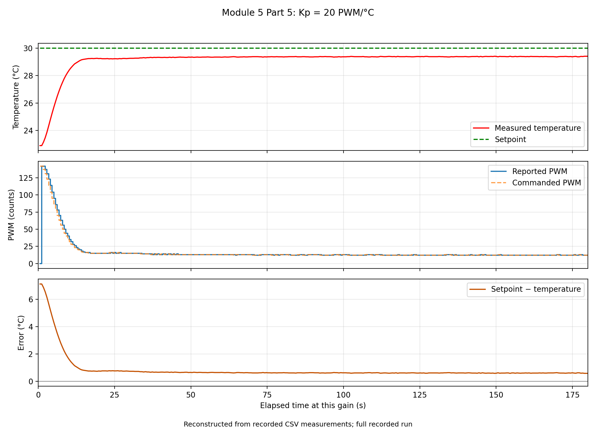

# Part 5: High-gain response

Setpoint: **30.0 °C**. The main table uses the **October 7 retests at gains 20, 40, and 50**, with the **original October 5 gain-30 run retained**. Mean temperatures use each run's final 60 s. Gain 10 is retained below as earlier supporting evidence.

| Kp (PWM/°C) | Settles? | Mean temperature (°C) | Response shape | Amplitude (°C) | Period (s) | Frequency (Hz) | Reported PWM range | Saturation? |
|---:|---|---:|---|---|---|---|---|---|
| 20 | Yes, approximately | 29.386 | Warms toward plateau; slight drift and irregular fluctuations, no clear coherent wave train | N/A | N/A | N/A | 0–142; final minute: 12–13 | No |
| 30 | No — recurring waves in recorded window | 29.591 | Small recurring irregular waves on plateau; original October 5 run | ≈0.01–0.015 | ≈20 (10–25) | ≈0.05 (0.04–0.10) | 11–17; final minute: 12–13 | No |
| 40 | Uncertain — burst diminishes | 29.682 | Rapid oscillatory burst, especially 55–100 s; varying amplitude, later diminished | ≈0.09 in burst | ≈1.70 in burst | ≈0.59 in burst | 4–24; final minute: 10–17 | No |
| 50 | Uncertain — waves versus noise unresolved | 29.743 | Small repeated irregular reversals; physical oscillation versus noise unresolved | ≈0.015 local | ≈3.96 local | ≈0.25 local | 12–16; final minute: 12–14 | No |

**Range/drift check (not sufficient to establish settling):** final-minute range ≤0.5 °C and absolute linear-fit drift ≤0.002 °C/s. Passing this criterion means bounded final behavior, not absence of waves. The new runs' final-minute ranges are 0.05, 0.19, and 0.06 °C at gains 20, 40, and 50. Their fitted drifts are approximately +0.000161, +0.0000151, and −0.00000207 °C/s, respectively. All pass the range/drift check, but that alone cannot justify a Yes in the settling column. Settling requires the transient to decay toward an approximately constant temperature, allowing measurement noise but excluding persistent resolved waves. Gain 20 appears approximately settled; gain 30 retains recurring waves and is marked No for the recorded window. Gain 40's burst diminishes, so eventual settling is uncertain. Gain 50's small reversals cannot confidently be distinguished from noise, so settling is uncertain. These labels do not claim that the observed waves are proven physical instabilities.

**Highest gain tested: 50 PWM/°C.** Its final-minute mean is 29.743 °C and dimensional droop is 0.257 °C. Compared with Part 3's gain-5 screenshot (29.50 °C, droop 0.50 °C), gain 50 is closer to target. Different days, thermal histories, and observation methods limit that comparison. The retest lasted approximately 180 s per gain. No reported PWM reached 255, and **shutdown telemetry confirmed PWM9 = PWM10 = 0** after the retests.

## How wave quantities were estimated

Amplitude means half a local peak-to-trough temperature difference, not error relative to the setpoint. The table's values describe recurring fluctuations or a selected burst; they are not all measurements of a stable sinusoid or a common natural frequency.

**Retained gain 30:** typical peak-to-trough variation is about 0.02–0.03 °C. Average nonoverlapping 5 s bins over 45–175 s, then select bin means higher than the preceding bin and at least as high as the following bin. Peak-bin centers are 57.5, 77.5, 102.5, 127.5, 137.5, 147.5, and 167.5 s. Their spacings are 20, 25, 25, 10, 10, and 20 s: median 20 s. The waves are small and near the 0.01 °C telemetry increment, so physical control instability is not established.

**Retested gains 40 and 50:** use raw samples and track running maxima/minima. Confirm an extremum after a reversal of at least 0.08 °C for gain 40 (55–100 s), or 0.025 °C for gain 50 (40 s to run end). Amplitude is the median half-difference of consecutive confirmed extrema; period is the median maximum-to-maximum spacing; frequency is its reciprocal. Gain 40 has 37 confirmed alternating extrema and peak spacings 1.13–6.23 s. Gain 50 has 53 confirmed alternating extrema and spacings 1.13–14.15 s. These broad ranges show irregular behavior. In particular, gain 50's detected reversals can include noise/quantization; its period is an exploratory statistic, not an established dominant frequency. Sampling is approximately 0.566 s, which also limits timing precision for rapid gain-40 reversals.

The [retest note](part5_retest_20261007.md) records detailed methods and limits. Gain 20 also produces extrema if a low threshold is used; detecting extrema alone is insufficient to establish a physical oscillation.

## Strip-chart traces

## Earlier supporting measurements

The [original October 5 CSV](high_gain_20261005_110725.csv) retains the previous runs at gains 10, 20, 30, and 40. Earlier means were 28.893, 29.422, 29.591, and 29.697 °C, respectively. The previous gain-20 and gain-40 means are superseded in the main table by the retests. Gain 10 had transient reversals, an isolated 31.49 °C spike, and later slow drift; the spike alone is not a proven thermal overshoot or a repeated oscillation.

## Exact code and data

- New acquisition: [run_high_gain_tests.py](run_high_gain_tests.py), with the existing Module 5 control calculation/parser and matching Arduino sketch.
- New raw measurements: [high_gain_retest_20261007_101645_660586.csv](high_gain_retest_20261007_101645_660586.csv), also preserved in `data/module_05/`.
- Retained gain 30: [kp30_original_20261005.csv](kp30_original_20261005.csv), also preserved in `data/module_05/`; 318 readings extracted unchanged from the original CSV.
- PNG reconstruction: [plot_strip_charts.py](plot_strip_charts.py), accepting `--input` and `--output-dir`. Original October 5 high-gain acquisition code/version remains unverified.

Ambient remains unmeasured; 27 °C in the Part 4/6 fractional-droop comparison is provisional.
