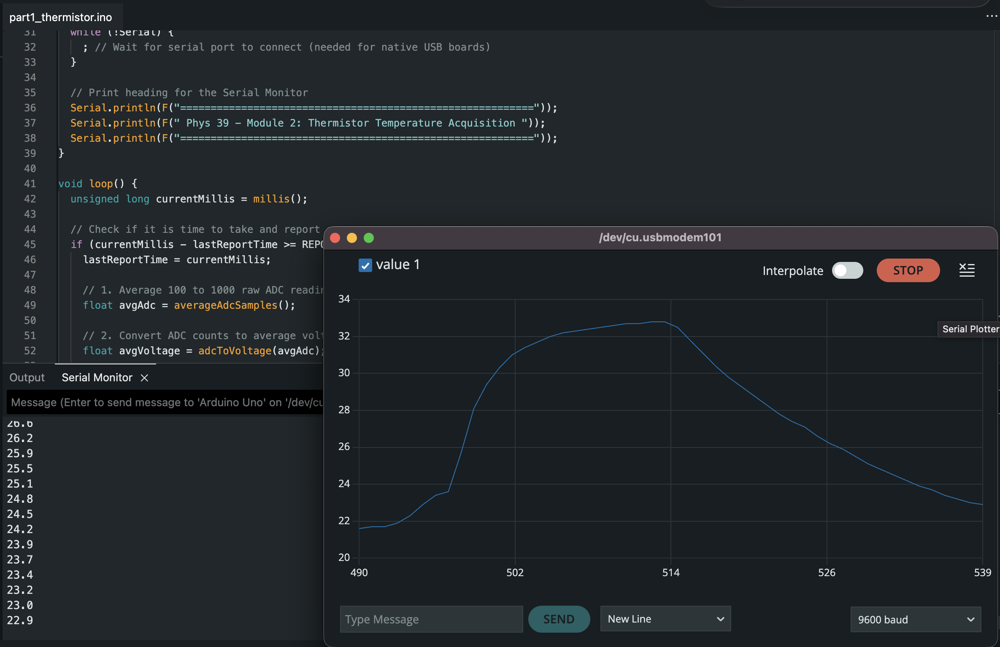
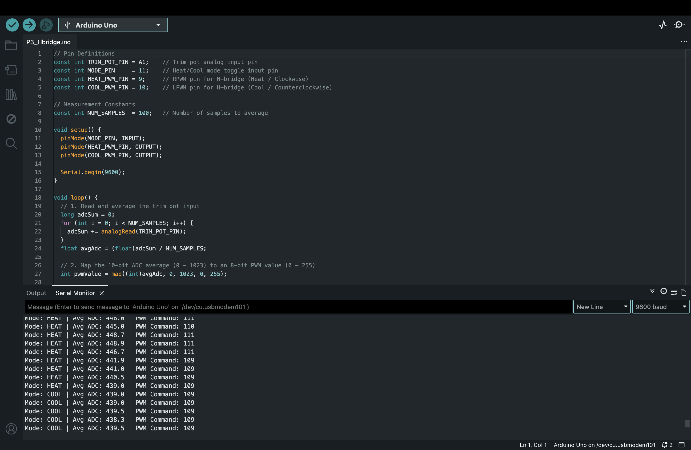
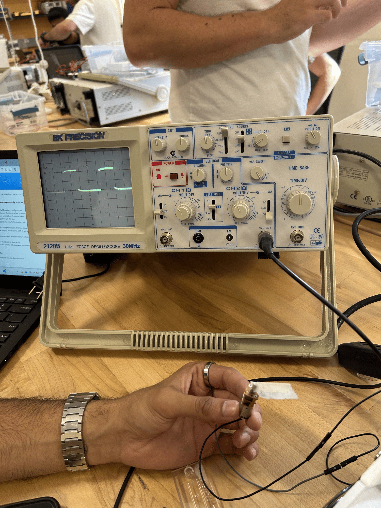
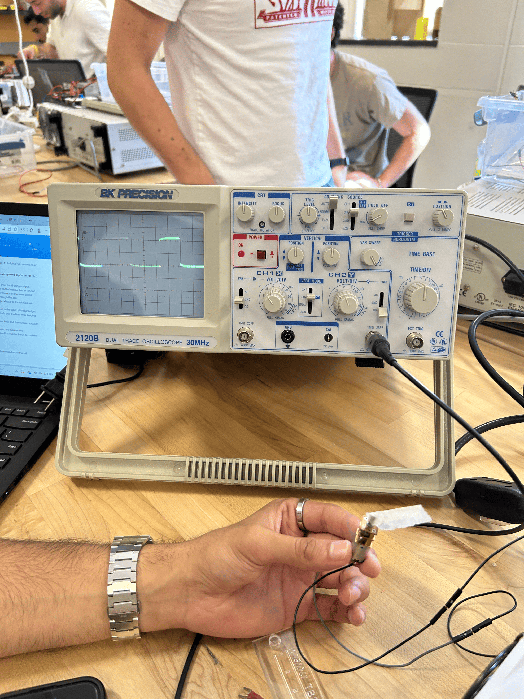
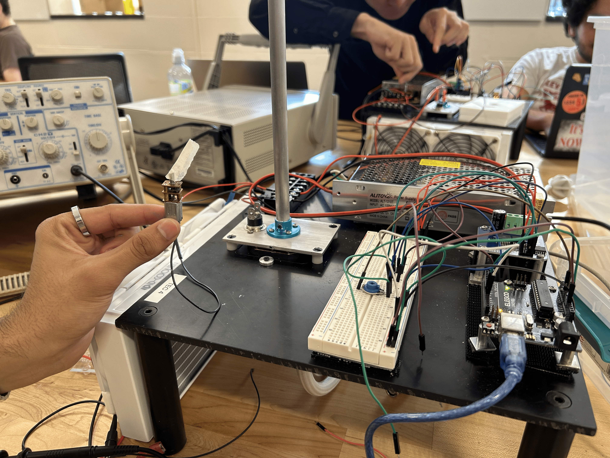

# Module 02 — Instrument Pieces

[P1 serial monitor](../../code/module2/P1_serial_monitor/P1_serial_monitor.ino): Displays the readings from the thermistor in a human readable format with extra detail         
[P2 thermistor plotter](../../code/module2/P2_serial_plotter/part2_thermistor.ino): Only displays one value so serial plotter can be used     
**Authoritative motor-control sketch:** [P3 H-bridge](../../code/module2/P3_Hbridge/P3_Hbridge/P3_Hbridge.ino).

## Thermistor measurement

```text
             +5.00 V (VREF)
                    |
            RFIXED = 100 kOhm
                    |
                    +---- A0 (Vout)
                    |
        NTC thermistor (RTH)
                    |
                   GND
```

Thermistor model constants: `R0 = 100 kOhm` at `T0 = 25.0 °C = 298.15 K`; `B = 3950 K`.  The fixed divider resistor is `RFIXED = 100 kOhm`; the ADC reference used in the sketches is 5.00 V.  The P1 capture shows these representative human-readable output lines:

```text
time = 98.00 s    average ADC = 300.3    voltage = 1.468 V    resistance = 41.56 kOhm    temperature = 46.2 C    samples = 100
time = 100.00 s   average ADC = 300.5    voltage = 1.469 V    resistance = 41.59 kOhm    temperature = 46.1 C    samples = 100
time = 109.00 s   average ADC = 299.6    voltage = 1.465 V    resistance = 41.42 kOhm    temperature = 46.2 C    samples = 100
```

For an averaged 10-bit ADC count, $\bar{n}$, the conversion used was:

$$
V_{\text{out}} = \frac{(5.00\text{ V})\bar{n}}{1023}.
$$

$$
R_{\text{TH}} = R_{\text{FIXED}}\frac{V_{\text{out}}}{5.00\text{ V} - V_{\text{out}}}.
$$

$$
T_{\text{C}} = \left[\frac{1}{T_0} + \frac{1}{B}\ln\left(\frac{R_{\text{TH}}}{R_0}\right)\right]^{-1} - 273.15\text{ °C}.
$$



*Figure 1. Serial Plotter evidence: temperature rises from about 21.6 °C to 32.8 °C while warmed, then falls to about 22.9 °C while cooling. The P2 sketch averages 500 ADC readings per plotted point.*

## PWM command and H-bridge

The signal path is `A1 trim pot → average 100 ADC readings → map 0–1023 to 0–255 → analogWrite()`.  Pin 11 selects direction.  The recorded serial monitor shows a command near `Avg ADC = 439`, `PWM Command = 109`, so the nominal duty is

$$
\frac{109}{255} \times 100\% = 42.7\%.
$$

| Command | D11 mode | Arduino D9 / RPWM | Arduino D10 / LPWM | Observed motor direction |
|---|---:|---|---|---|
| Heat | HIGH | PWM at the requested duty | 0 V / off | Clockwise |
| Cool | LOW | 0 V / off | PWM at the requested duty | Counterclockwise |

### Completed H-bridge signal table

| Command | D11 (mode select) | D9 / RPWM | D10 / LPWM | H-bridge output state | Motor rotation |
|---|---:|---|---|---|---|
| Heat / clockwise | HIGH | PWM at the requested duty | 0 V / off | M+ driven by active PWM, M− effectively at the return/reference side | Clockwise |
| Cool / counterclockwise | LOW | 0 V / off | PWM at the requested duty | M− driven by active PWM while M+ is the return/reference side; terminal polarity reverses | Counterclockwise |

This is the complete logic used in the lab: the Arduino does not drive both H-bridge inputs at the same time. Instead, pin 11 selects the active direction, and the selected H-bridge input receives the PWM command while the other input is held at 0 V. Reversing the command between D9 and D10 reverses the average motor voltage and therefore reverses the shaft direction at the same duty cycle.



*Figure 2. Serial evidence records the same approximately 109/255 command in HEAT and COOL; changing D11 transfers PWM between pins 9 and 10.*

## Oscilloscope and motion record

The oscilloscope captures document both operating states: [heat/clockwise](../images/module2/P3_Hbridge/heat_mode_oscilloscope.png) and [cool/counterclockwise](../images/module2/P3_Hbridge/cool_mode_oscilloscope.png).  With the recorded command, the active Arduino PWM pin was a 0–5 V logic waveform at approximately **490 Hz** with approximately **43% duty**; the inactive pin remained at 0 V.  The frequency is the Uno `analogWrite()` frequency for pins 9 and 10, and the duty is independently set by the logged command (109/255); the photographs are the retained visual scope evidence.

 

*Figure 3. Scope evidence. In heat, D9/RPWM is pulsed and D10/LPWM is low; in cool, D10/LPWM is pulsed and D9/RPWM is low.*

The scope channels compared the motor-output terminals **M+** and **M−** relative to the H-bridge/Arduino common logic ground: both probe ground clips were connected to that common ground (not to either floating motor terminal).  In clockwise/heat, M+ is driven in the active-PWM polarity while M− is the complementary/return side; in counterclockwise/cool, the assignment reverses.  Thus the two terminal waveforms swap roles when direction changes, producing a reversed average motor voltage.  This is consistent with the direction table and the [motor video](../images/module2/P3_Hbridge/motor_video.MOV).

At a fixed direction, increasing the trim-pot setting increased PWM duty and visibly increased motor speed; reducing it decreased speed.  Switching HEAT to COOL reversed the observed rotation from clockwise to counterclockwise at the same approximate PWM command.



*Figure 4. Module 2 apparatus: Arduino, trim pot, H-bridge, supply, and motor fixture.*
