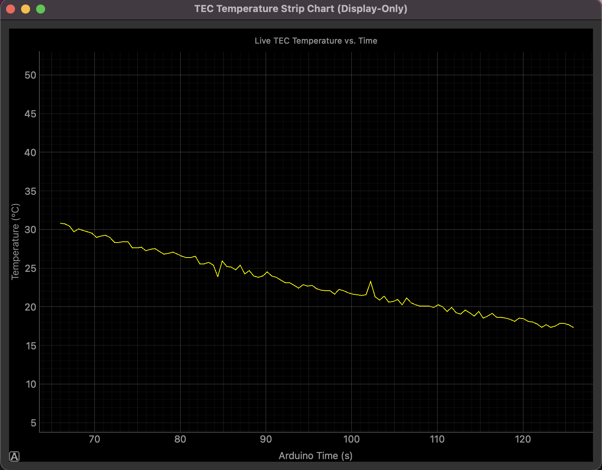
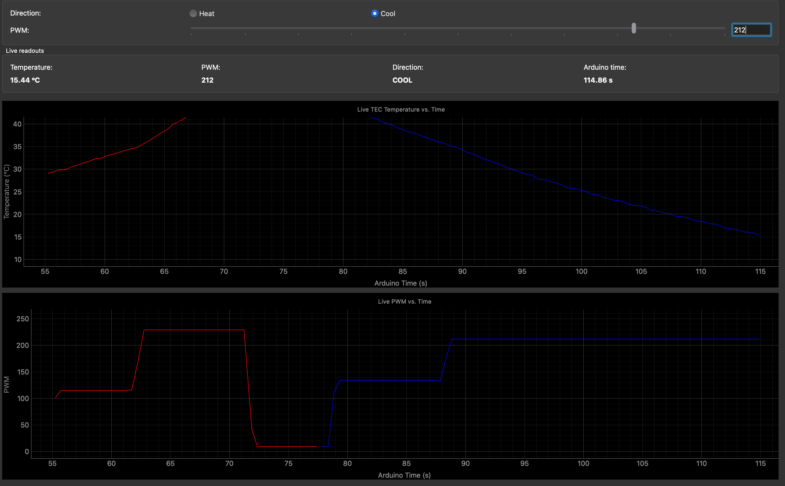
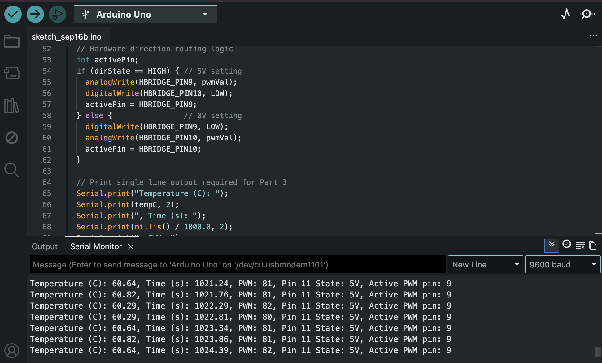
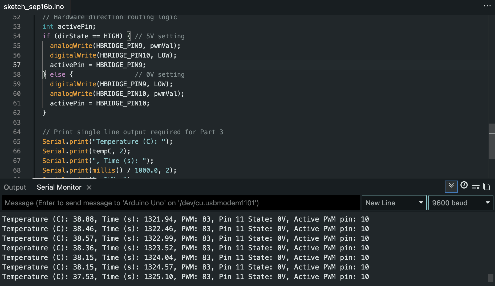
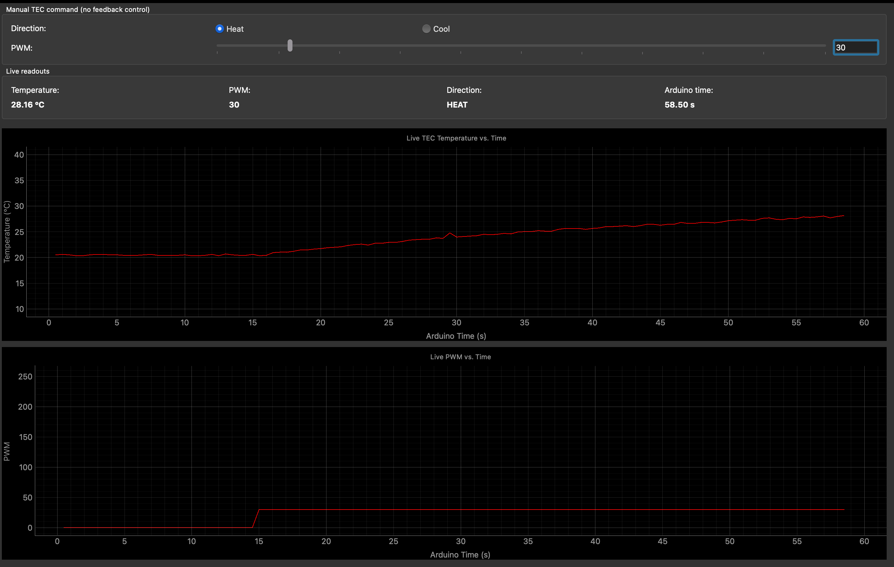

# Module 03 — TEC Instrument and First Python GUI

[Module 3 checklist](./module_03_item_checklist.md)

[Part 2 manual sketches and H-bridge notes](./module_02_instrument_pieces.md)

[Arduino sketch set for Module 3]:
- [P2 First Manual Sketch](../../code/module3/P2_First_Manual_Sketch/P2_First_Manual_Sketch.ino)
- [P3 SPDT switch](../../code/module3/P3_SPDT_switch/P3_SPDT_switch.ino)
- [P4 Rolling display](../../code/module3/P4_Rolling_display/P4_Rolling_display.py)
- [P5 Manual controls](../../code/module3/P5_Manual_controls/P5_Manual_heat_cool_display.py)
- [P6 Arduino serial-command](../../code/module3/P6_Arduino_Serial-Command/P6_Arduino_Serial-Command.ino)

This material supports C3, the TEC instrument and first Python GUI demonstration. The project uses a thermistor to measure temperature, an H-bridge to drive the TEC with controlled direction and PWM, and a Python GUI to send manual commands over serial. The work here is a demonstration of instrumentation and actuation, not of closed-loop feedback control.

## Thermistor measurement and data acquisition

The Arduino measures the thermistor voltage divider on A0 with the same thermistor model used in Module 2. The fixed resistor and thermistor form a divider, and the sketch converts the ADC reading into temperature using the Beta-model relation.

```text
             +5.00 V (VREF)
                    |
            RFIXED = 100 kOhm
                    |
                    +---- A0 (Vout)
                    |
        NTC thermistor (RTH)
                    |
                   GND
```

The Module 3 sketches read the thermistor, average multiple ADC samples, compute temperature, and report time, temperature, and PWM state. The measured temperature is printed to the Arduino Serial Monitor and optionally captured by the Python display program.

### Representative telemetry format

```text
Temperature (C): 27.73, Time (s): 645.06, PWM: 120, DIR: HEAT
```

This line is the main measurement record: it includes temperature, elapsed time, current PWM command, and the selected direction. The Python GUI parses this information for plotting, live readouts, and CSV logging.

## Manual actuation: PWM and direction control

The H-bridge circuit is the actuation stage. The Arduino does not close a temperature loop; instead, it applies a chosen PWM command and chooses the direction according to the manual input.

The control pathway is:

```text
trim pot / GUI command -> set PWM value -> select HEAT or COOL -> H-bridge input pin 9 or 10 receives PWM -> TEC output changes sign / direction
```

The final serial-command sketch uses the Python GUI to send commands such as:

```text
SET PWM 120 DIR HEAT
SET PWM 45 DIR COOL
```

The Arduino enforces the required safety behavior:
- only one H-bridge input receives PWM at a time,
- a malformed or unknown command sets the output to zero,
- valid PWM values are clamped to the range 0–255.

## H-bridge command table

The verified H-bridge logic used in the lab is:

| Command | D11 mode | Arduino D9 / RPWM | Arduino D10 / LPWM | Observed motor direction |
|---|---:|---|---|---|
| Heat | HIGH | PWM at the requested duty | 0 V / off | Clockwise |
| Cool | LOW | 0 V / off | PWM at the requested duty | Counterclockwise |

This is the logic used to reverse the average applied voltage across the TEC while keeping the same overall command magnitude. At fixed duty cycle, switching between HEAT and COOL flips the terminal polarity and therefore reverses the shaft direction.

## Python GUI and serial workflow

The Python GUI is the first complete control interface for this project. It sends commands to the Arduino and receives telemetry in return.

### Display-only program: P4

[P4 Rolling display](../../code/module3/P4_Rolling_display/P4_Rolling_display.py) reads serial telemetry and displays the most recent temperature history in a rolling strip-chart view. It also prints live serial text and logs the data to CSV.



*Figure: Rolling display program showing live temperature trace and serial output from the display-only TEC monitoring setup.*

### Manual-control program: P5

[P5 Manual controls](../../code/module3/P5_Manual_controls/P5_Manual_heat_cool_display.py) adds manual command controls for PWM and direction. The GUI includes:
- Heat / Cool radio buttons,
- a PWM slider and numeric edit box,
- live temperature, time, and PWM readouts,
- red/blue logging history separated by direction,
- CSV logging with one row per accepted measurement.



*Figure: Manual-control GUI showing the PWM command and plot while switching between heating and cooling states.*

### Final serial-command sketch: P6

[P6 Arduino serial-command](../../code/module3/P6_Arduino_Serial-Command/P6_Arduino_Serial-Command.ino) replaces the earlier trim-pot and manual SPDT logic with serial-based command parsing. It reads the thermistor, reports temperature, receives direction/PWM commands from the GUI, and applies the selected TEC output.

The firmware deliberately has no feedback loop. It simply measures and acts on the command that is sent. This is the key distinction between measurement, manual actuation, and feedback control.

## Measurement vs manual actuation vs feedback control

Measurement is the reading of temperature from the thermistor and display of that value to the user or the computer. Manual actuation is the direct setting of TEC direction and PWM by the user through the GUI or switch; the device applies the command but does not decide a new value on its own. Feedback control would measure the temperature, compare it to a setpoint, and automatically adjust PWM and direction to reduce the error. In this project, the measuring and actuation steps are present, but the control loop is intentionally absent: the user decides the command.

## Evidence and required records

The repository must contain the following evidence. Some items are already present in the project, while other pieces remain placeholders for later capture.

### Completed items

- [x] Completed pre-power checklist and final wiring record in [module_03_item_checklist.md](./module_03_item_checklist.md)
- [x] Arduino sketches for P2, P3, and P6 are saved in the repository
- [x] Python display and manual-control programs are saved in the repository
- [x] CSV data file exists and is saved with units in the column headings
- [x] P4 and P5 GUI screenshots stored in the evidence folder

## Module 3 oscilloscope evidence

The required oscilloscope check compares the H-bridge control pins and motor output terminals while the TEC is powered and the command is at a low PWM duty cycle approved by the instructor.

| Pin 11 input | Pin 9 waveform | Pin 10 waveform | M+ waveform | M- waveform | PWM frequency | PWM duty cycle |
| :--- | :--- | :--- | :--- | :--- | :--- | :--- |
| **5V** (HEAT / clockwise) | PWM, active, 0–5 V | 0 V / low | Active PWM on M+ | 0V | ~490 Hz | ~100% |
| **0V** (COOL / counterclockwise) | 0 V / low | PWM, active, 0–5 V | 0V | Active PWM on M− | ~490 Hz | ~0% |

## Serial records and test summaries

### Heating record



*Figure: Heating serial record with the active H-bridge output on pin 9 and the HEAT/clockwise command selected.*

### Cooling record



*Figure: Cooling serial record with the active H-bridge output on pin 10 and the COOL/counterclockwise command selected.*

### Startup and commanded-safety tests



*Figure: Safe-start evidence with PWM at 0 at startup, confirming the TEC begins in a non-powered state before a command is received.*


## Data file

The CSV log is generated by the GUI and saved beside the Python program at:

- [code/module3/P5_Manual_controls/tec_manual_data.csv](../../code/module3/P5_Manual_controls/tec_manual_data.csv)

The file should include column headings with units, such as:

```text
time_s,temperature_C,pwm,direction
```


## AI use note

We mainly used AI to make the scripts for the arduino as well as for the python interface in part 5. At several points in the lab we tested the output of the digital pins 10 and 9 to make sure that the Hbridge was recieving the right signal before turning on the TEC. We looked at the duty cycle to verify that the PWM was getting passed correctly as well as whether the circuit was heating or cooling. I can explain the general flow of how the arduino is passing the input form A0 to convert to a PWM value for designating the strength of heating and cooling. As well as using pin 11 for switching between cooling and heating.

## Summary

Module 3 demonstrates the basic instrumentation chain for a thermoelectric cooler: temperature measurement on the thermistor, manual PWM/direction actuation through the H-bridge, and serial telemetry displayed by a Python GUI. The final C3 evidence package should combine the code, screenshots, and written notes into a single organized project record. The remaining placeholders should be filled in as the final evidence is captured and approved.
