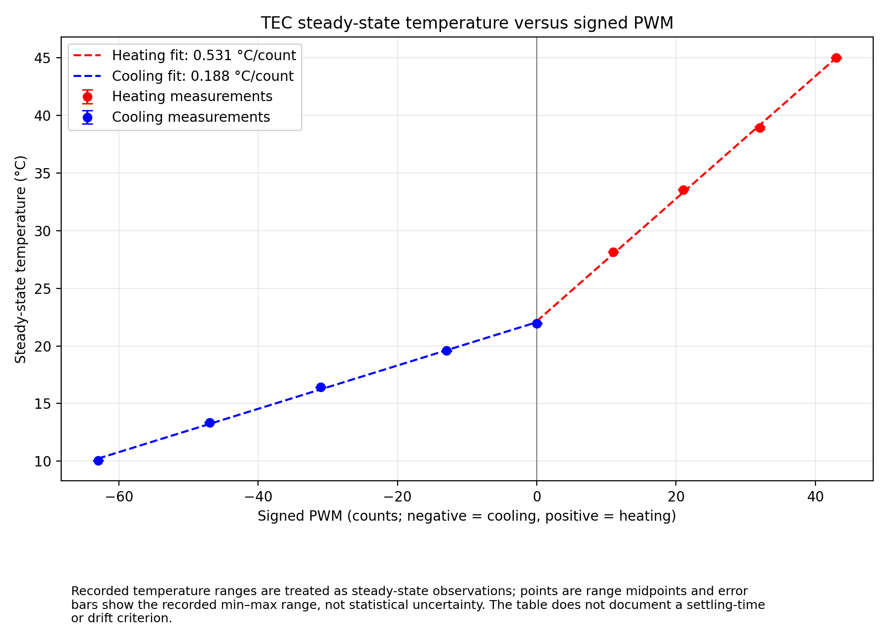

# A2 — TEC Heating and Cooling Analysis

Assignment code: A2      
Module: PHYS39 Module 4   
Team members: Kyle Chen and Muhammad Hasan   
Date: October 5, 2026

Final submission: [A2_Chen_Hasan.pdf](A2_Chen_Hasan.pdf). This file preserves the detailed working analysis.

| Task | Required output |
|---|---|
| **1. Measure the slopes** | Heating and cooling slopes, units, PWM ranges used, their magnitude ratio, and a brief comment on curvature. |
| **2. Derive the heat balance** | The PWM current-average proof, an explanation of why mean-square current matters, the steady-state temperature/slope derivation, and the numerical Joule-to-Peltier heat ratio. |
| **3. Use the Laird data** | Four cited values at a hot-side temperature of 27 °C, their meanings and test conditions, and calculations of maximum-current Joule heat, Peltier heat, and the predicted slope ratio. |
| **4. Interpret the results** | A measured-versus-predicted comparison, reasons they may differ, why full PWM does not guarantee maximum rated current, and an explanation of passive conduction. |

## 1. Measured heating and cooling slopes

The following values are transcribed from the **rounded fit labels on the graph**. Small differences from calculations using unrounded fit coefficients are expected.

| Branch | Slope versus signed PWM | Signed PWM fit range | Slope versus increasing PWM magnitude |
|---|---:|---:|---:|
| Heating | +0.531 °C/count | 0 to +43 | +0.531 °C/count |
| Cooling | +0.188 °C/count | −63 to 0 | −0.188 °C/count |

For the assignment, let $p$ be the nonnegative PWM magnitude in either direction. Then

$$
m_h=\frac{dT_h}{dp}=+0.531\;\frac{{}^{\circ}\mathrm{C}}{\text{PWM count}},
\qquad
m_c=\frac{dT_c}{dp}=-0.188\;\frac{{}^{\circ}\mathrm{C}}{\text{PWM count}}.
$$

The cooling slope on the **signed-PWM graph** is positive because moving toward zero PWM raises the temperature. Its magnitude is unchanged by the sign convention.

$$
\boxed{
r=\frac{m_h}{|m_c|}
=\frac{0.531}{0.188}
\approx 2.8245\approx 2.82
}
$$

Both branches are approximately linear over their measured ranges. There are small point-to-line deviations and slight changes in local slope, rather than strong curvature. The plotted error bars represent recorded temperature ranges, not statistical uncertainties; the graph treats these measurements as steady-state observations.

## 2. PWM averaging and steady-state energy balance

### A. Average current and mean-square current

Let $\tau$ be the PWM period, $D$ the duty cycle, and $I$ the current during the ON portion of the cycle:

$$
i(t)=
\begin{cases}
I, & 0\leq t<D\tau,\\
0, & D\tau\leq t<\tau.
\end{cases}
$$

The cycle-averaged current is

$$
\langle i\rangle
=\frac{1}{\tau}\int_0^\tau i(t)\,dt
=\frac{1}{\tau}\int_0^{D\tau} I\,dt
=\frac{ID\tau}{\tau}
=\boxed{DI}.
$$

Similarly, the mean-square current is

$$
\langle i^2\rangle
=\frac{1}{\tau}\int_0^\tau i(t)^2\,dt
=\frac{1}{\tau}\int_0^{D\tau} I^2\,dt
=\boxed{DI^2}.
$$

Squaring the average instead gives a different result:

$$
\langle i\rangle^2=D^2I^2,
\qquad
\langle i^2\rangle-\langle i\rangle^2=D(1-D)I^2.
$$

For nonzero current and $0<D<1$, this difference is positive. Peltier transport is proportional to $\langle i\rangle$, while Joule heating is proportional to $\langle i^2\rangle$. Therefore, **both contributions scale linearly with duty cycle at fixed ON-state current**:

$$
\overline{\dot Q}_{P}\propto DI,
\qquad
\overline{\dot Q}_{J}\propto DI^2.
$$

Replacing the pulses with a DC current of magnitude $DI$ would incorrectly make the Joule term proportional to $D^2I^2$. That substitution would predict a duty-dependent temperature slope. The approximate linearity of the measured graph is consistent with the pulsed model, although the temperature graph alone does not establish the current waveform.

### B. Energy balance at steady state

Use the following definitions:

| Symbol | Meaning | Units |
|---|---|---|
| $T_o$ | Object-face temperature | °C or K |
| $T_0$ | Zero-PWM equilibrium temperature | °C or K |
| $C$ | Object thermal capacitance | J/K |
| $G$ | Effective passive thermal conductance | W/K |
| $\dot Q_P$ | Positive ON-state Peltier heat-transfer magnitude | W |
| $\dot Q_J$ | Positive ON-state Joule heat delivered to the object face | W |

Combine TEC conduction and other passive heat leaks into $G$. The simplified $\dot Q_{\mathrm{TEC}}$ contains **only the current-dependent terms**, so passive TEC conduction must not be included a second time.

$$
C\frac{dT_o}{dt}
=\dot Q_{\mathrm{TEC}}-G(T_o-T_0).
$$

At steady state,

$$
\frac{dT_o}{dt}=0
\quad\Longrightarrow\quad
\boxed{G(T_o-T_0)=\dot Q_{\mathrm{TEC}}}.
$$

The individual heat flows generally remain nonzero; their sum is zero.

Peltier transport reverses when current reverses, but Joule heating does not:

$$
\dot Q_{\mathrm{TEC},h}=D(\dot Q_P+\dot Q_J),
\qquad
\dot Q_{\mathrm{TEC},c}=D(-\dot Q_P+\dot Q_J).
$$

Substituting into the steady-state balance gives

$$
T_{o,h}(D)-T_0=\frac{D(\dot Q_P+\dot Q_J)}{G},
$$

$$
T_{o,c}(D)-T_0=-\frac{D(\dot Q_P-\dot Q_J)}{G}.
$$

For net cooling, $\dot Q_P>\dot Q_J$. Differentiating with respect to duty cycle yields

$$
\frac{dT_{o,h}}{dD}=\frac{\dot Q_P+\dot Q_J}{G},
\qquad
\left|\frac{dT_{o,c}}{dD}\right|=\frac{\dot Q_P-\dot Q_J}{G}.
$$

Since $D=p/255$, the two PWM slope magnitudes both contain a factor of $1/255$. It cancels from their ratio, as does the common conductance:

$$
r=\frac{m_h}{|m_c|}
=\frac{\dot Q_P+\dot Q_J}{\dot Q_P-\dot Q_J}.
$$

Rearranging,

$$
r(\dot Q_P-\dot Q_J)=\dot Q_P+\dot Q_J
\quad\Longrightarrow\quad
(r-1)\dot Q_P=(r+1)\dot Q_J.
$$

Therefore,

$$
\boxed{
\frac{\dot Q_J}{\dot Q_P}
=\frac{r-1}{r+1}
=\frac{2.8245-1}{2.8245+1}
\approx 0.4771
}
$$

Under this model, the object-face Joule contribution is approximately **47.7% of the Peltier contribution**. This is a relative contribution, not an electrical efficiency or an absolute heat-flow measurement.

The requested algebra check is

$$
r=2\quad\Longrightarrow\quad
\frac{\dot Q_J}{\dot Q_P}=\frac{2-1}{2+1}=\frac13.
$$

The derivation assumes comparable ON-state current and passive conductance in both directions, with approximately constant properties over the fitted ranges.

### C. Signed-duty formulation requested in the assignment

Let $s$ be signed PWM and $u=s/255$ be signed duty cycle, so $D=|u|$. The combined current-dependent heat rate is

$$
\dot Q_{\mathrm{TEC}}=u\dot Q_P+|u|\dot Q_J.
$$

For heating ($u\geq0$) and cooling ($u\leq0$), respectively,

$$
T_{o,h}-T_0=\frac{u(\dot Q_P+\dot Q_J)}{G},\qquad
T_{o,c}-T_0=\frac{u(\dot Q_P-\dot Q_J)}{G}.
$$

Thus both signed-duty derivatives are positive in the cooling regime $\dot Q_P>\dot Q_J$:

$$
\frac{dT_{o,h}}{du}=\frac{\dot Q_P+\dot Q_J}{G},\qquad
\frac{dT_{o,c}}{du}=\frac{\dot Q_P-\dot Q_J}{G}.
$$

The signed-PWM slopes are $m_{h,s}=(\dot Q_P+\dot Q_J)/(255G)$ and $m_{c,s}=(\dot Q_P-\dot Q_J)/(255G)$. Their ratio $m_{h,s}/m_{c,s}=2.8245$ gives the same result as the magnitude convention above.

## 3. Laird maximum-current calculation

### A. Values, meanings, and conditions

**Source:** Laird Thermal Systems, *CP14-127-045-L2-W4.5*, manufacturer part **58910-501**, revision 00, June 1, 2022; **page 3, hot-side temperature 27 °C column** of the [supplied data sheet](../../code/module4/P5_Heat_balance_analysis/laird-tec-cp14-127-045.pdf).

| Quantity | Value | Meaning and stated condition |
|---|---:|---|
| $R_{\mathrm{el}}$ | 1.50 Ω | Module electrical resistance in the 27 °C hot-side column. |
| $I_{\max}$ | 8.6 A | Rated current identified by the sheet as the current at $\Delta T_{\max}$. |
| $\dot Q_{c,\max}$ | 71.3 W | Maximum cold-side heat removal at zero face-to-face temperature difference, $\Delta T=0$. |
| $\Delta T_{\max}$ | 70.5 K | Maximum face-to-face temperature difference at zero cold-side heat load, $\dot Q_c=0$. |

A temperature **difference** of 70.5 K equals a difference of 70.5 °C; it is not an absolute operating temperature. Thermal pumping power is also distinct from electrical input power. These ratings describe different test conditions.

### B. Object-face Joule heat

Following the simplified maximum-current construction specified in Part 5, passive TEC conduction vanishes at $\Delta T=0$, and half the Joule heat is assigned to each face:

$$
\dot Q_{J,\max}
=\frac12 I_{\max}^{2}R_{\mathrm{el}}
=\frac12(8.6\,\mathrm{A})^2(1.50\,\Omega)
=\boxed{55.47\,\mathrm{W}}.
$$

### C. Peltier heat

Using the relation requested in the assignment,

$$
\dot Q_{c,\max}=\dot Q_{P,\max}-\dot Q_{J,\max},
$$

so

$$
\dot Q_{P,\max}
=\dot Q_{c,\max}+\dot Q_{J,\max}
=71.30+55.47
=\boxed{126.77\,\mathrm{W}}.
$$

### D. Predicted heating-to-cooling ratio

$$
\begin{aligned}
r_{\mathrm{Laird},\max}
&=\frac{\dot Q_{P,\max}+\dot Q_{J,\max}}
{\dot Q_{P,\max}-\dot Q_{J,\max}}\\[4pt]
&=\frac{126.77+55.47}{126.77-55.47}\\[4pt]
&=\frac{182.24}{71.30}
=\boxed{2.5560\approx2.56}.
\end{aligned}
$$

This is the assignment's simplified prediction from the listed ratings. It does not imply that all listed maxima occur at one test point or that the laboratory current equals $I_{\max}$.

## 4. Comparison and interpretation

### A. Measured versus predicted ratio

| Result | Ratio |
|---|---:|
| Measured from the rounded graph slopes | 2.8245 |
| Laird maximum-current prediction | 2.5560 |

The relative difference, taking the prediction as the reference, is

$$
\frac{r-r_{\mathrm{Laird},\max}}
{r_{\mathrm{Laird},\max}}\times100\%
=\frac{2.8245-2.5560}{2.5560}\times100\%
\approx\boxed{10.5\%}.
$$

The measured ratio is approximately **10.5% higher**. Exact agreement is not required:

- **Full duty cycle is not maximum rated current.** $D=1$ means that the H-bridge remains ON; current still depends on supply voltage and current limit, bridge voltage drop, wiring, and TEC resistance.
- **PWM and steady DC are different operating conditions.** Heating depends on the mean-square current as well as its average.
- **The face temperatures differ.** Finite temperature differences, temperature-dependent material properties, and passive heat paths affect the laboratory response.
- **The fitted slopes are approximations.** Slight curvature and the selected PWM ranges affect the measured ratio.

The graph alone cannot determine how much each effect contributes to the discrepancy.

### B. Passive conduction

When the object is hotter than room temperature, passive heat flows **out of the object**. When the object is colder than room temperature, passive heat flows **into the object**. Thus passive conduction opposes the temperature displacement in both directions.

For approximately symmetric conduction, the same $G$ reduces both temperature excursions and cancels from their slope ratio. **Conduction alone therefore cannot explain unequal heating and cooling slope magnitudes.** Peltier transport changes sign with current, while Joule heating always adds heat to the object: it assists heating and opposes cooling. Unequal effective conductances can modify the measured ratio, but that is beyond the symmetric model used in the derivation.

## 5. Conclusion

The measured heating slope is 0.531 °C per PWM count, while the cooling slope versus signed PWM is 0.188 °C per count, giving a ratio of 2.82. Under the symmetric, fixed-current model, this implies that object-face Joule heating is about 47.7% of the Peltier heat-transfer magnitude. Peltier transport reverses with current, whereas Joule heating always adds heat, assisting heating and opposing cooling. PWM makes both contributions proportional to duty cycle, consistent with the approximately linear measured branches. Passive conduction opposes both temperature excursions and cancels from the ratio when its conductance is equal in both directions. The measured ratio is about 10.5% higher than the manufacturer-based prediction of 2.56. Different operating currents, face temperatures, and thermal conditions limit this comparison; the result is a model-based inference rather than a direct heat-flow measurement.
