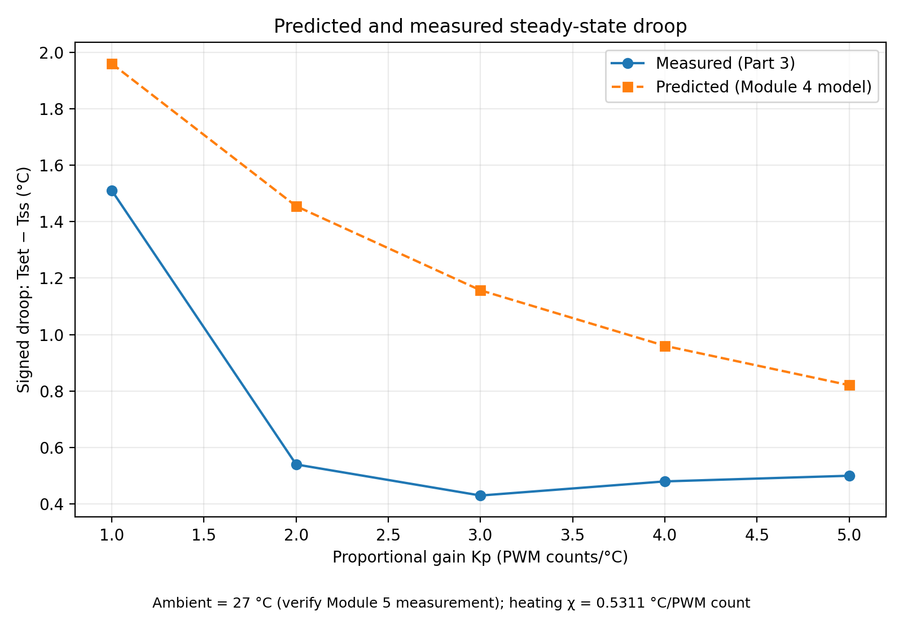
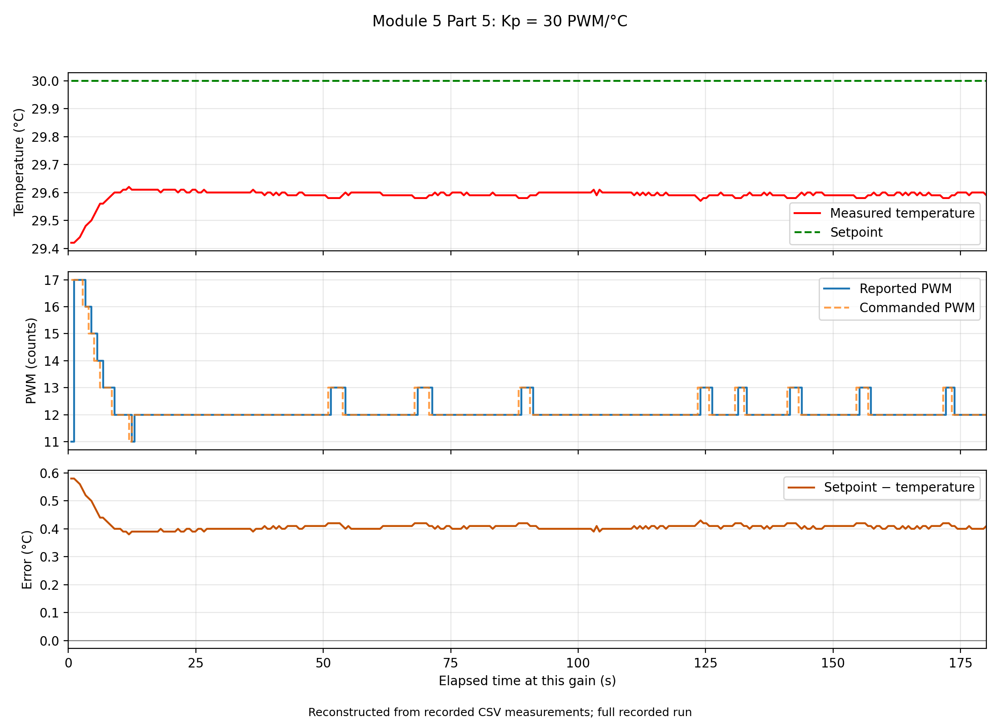
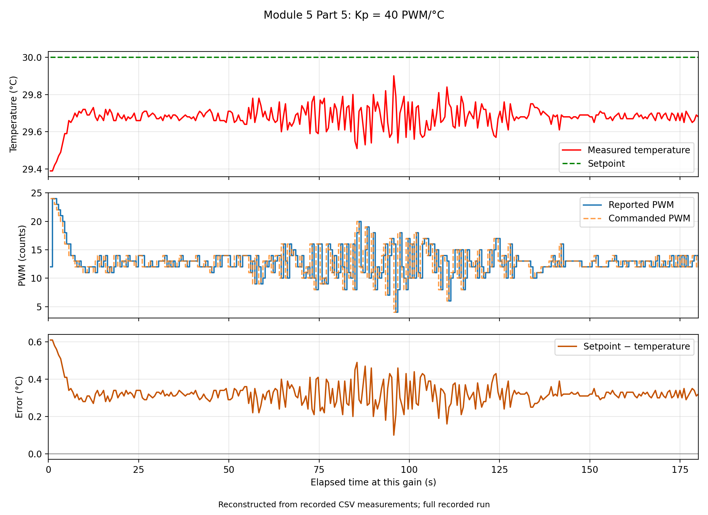
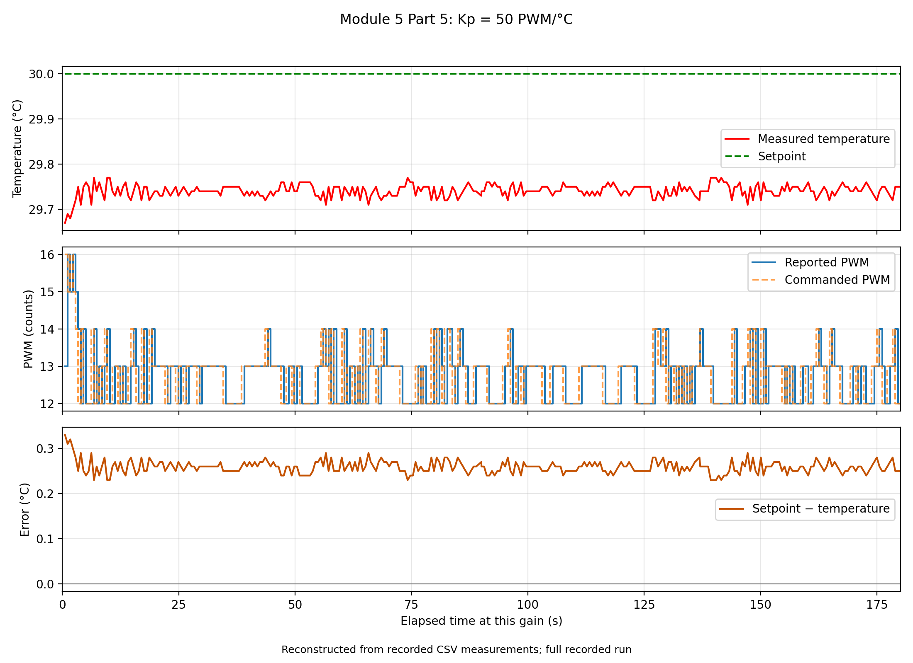

# Module 5: P-only control — Part 6 interpretation and preserved evidence

These notes preserve the three Part 6 responses for A3 and preparation for C4. No separate Module 5 paper is required.

## 1. Why P-only control has droop

The one-lump energy balance is

$$C\frac{dT}{dt}=P_uK_p(T_{set}-T)-H(T-T_{amb}).$$

Here $C$ is thermal capacity (J/°C), $P_u$ is actuator strength (W/PWM count), $K_p$ is proportional gain (PWM counts/°C), and $H$ is passive thermal conductance (W/°C). Every term in the balance has units of watts.

At a setpoint above ambient, $T=T_{set}$ makes the error and commanded TEC heat flow zero. However, $H(T_{set}-T_{amb})>0$, so heat continues to leave the block. Consequently $dT/dt<0$: the block cools, creating positive error and restoring heating. A nonzero positive error is needed to supply the heat lost to the room.

Below ambient, reaching the setpoint also commands zero TEC heat flow. The room then transfers heat into the colder block, so it warms. The resulting negative error commands cooling. Thus the settled temperature lies toward ambient from either nonambient setpoint.

At steady state, set $dT/dt=0$:

$$P_uK_p(T_{set}-T_{ss})=H(T_{ss}-T_{amb}).$$

Let $e_{ss}=T_{set}-T_{ss}$, so $T_{ss}-T_{amb}=T_{set}-T_{amb}-e_{ss}$. Substitution gives

$$(P_uK_p+H)e_{ss}=H(T_{set}-T_{amb}),$$

and therefore

$$e_{ss}=\frac{T_{set}-T_{amb}}{1+K_pP_u/H}
=\frac{T_{set}-T_{amb}}{1+\chi K_p}.$$

Defining $L=K_pP_u/H=\chi K_p$ yields

$$\frac{T_{set}-T_{ss}}{T_{set}-T_{amb}}=\frac{1}{1+L}.$$

This is the Part 4 droop equation. Agreement requires a settled response, constant ambient and setpoint, locally constant actuator strength and passive conductance, the appropriate directional susceptibility, correctly signed proportional feedback, and no saturation or added bias/integral action. The dynamic one-lump description additionally assumes uniform temperature and instantaneous measurement and actuation. Integer PWM and delays can make the real apparatus differ from this idealization.

## 2. Susceptibility and thermal capacity

For a constant signed PWM $u$, the open-loop steady-state balance is

$$0=P_uu-H(T-T_{amb}),\qquad T=T_{amb}+\frac{P_u}{H}u.$$

Differentiating at fixed ambient gives

$$\chi_{T,u}=\frac{dT}{du}=\frac{P_u}{H},\qquad
[\chi_{T,u}]=\frac{\mathrm{W/PWM\ count}}{\mathrm{W/°C}}
=\mathrm{°C/PWM\ count}.$$

For heating, $u=P>0$, so $\chi_{T,h}=P_u/H$. For cooling, positive magnitude $P=-u$, so $dT/dP=-P_u/H$ and $|\chi_{T,c}|=P_u/H$ within the corresponding directional model. Our Module 4 fitted values differ: heating is **0.5311 °C/count**, while cooling magnitude is **0.1878 °C/count**. A single constant actuator strength does not describe both directions equally well; use the heating value for these heating experiments.

Holding other parameters fixed:

- Doubling $P_u$ doubles susceptibility and $L$, reducing steady-state fractional droop.
- Doubling $H$ halves susceptibility and $L$, increasing fractional droop.
- Doubling $C$ changes neither susceptibility nor steady-state droop. It doubles the model's time constant.

To see the last result, write $\theta=T-T_{ss}$ and subtract the steady-state balance:

$$C\frac{d\theta}{dt}=-(H+P_uK_p)\theta,$$

$$\tau_{cl}=\frac{C}{H+P_uK_p}=\frac{C/H}{1+L},\qquad
\theta(t)=\theta(0)e^{-t/\tau_{cl}}.$$

Thermal capacity sets how much stored energy must change during a transient. At steady state stored energy stops changing, so $C$ drops out of the balance. The measurements here do not independently determine $C$, $H$, or $P_u$, so no numerical time constant is claimed.

## 3. Loop gain and fractional-droop comparison

Use $L=0.5311K_p$ for the heating runs. The table below assumes $T_{set}=30$ °C and **provisional $T_{amb}=27$ °C**, so the measured fractional droop is $(30-T_{ss})/3$. Part 3 values are individual live readouts transcribed from the five screenshots, not verified steady-state averages; Part 5 temperatures are final-60-s means: October 7 retests for gains 20, 40, and 50; retained October 5 data for gain 30 and earlier supporting gain 10. Days and thermal histories differ. The same ambient has not been verified for either set of runs, so the measured fractions and agreement assessment remain provisional. $L$ itself does not depend on this ambient assumption.

| $K_p$ (PWM/°C) | Measured $T_{ss}$ or final-minute mean (°C) | $L$ | Measured fractional droop | Predicted $1/(1+L)$ | Source |
|---:|---:|---:|---:|---:|---|
| 1 | 28.490 | 0.5311 | 0.503 | 0.653 | Part 3 screenshot |
| 2 | 29.460 | 1.0622 | 0.180 | 0.485 | Part 3 screenshot |
| 3 | 29.570 | 1.5933 | 0.143 | 0.386 | Part 3 screenshot |
| 4 | 29.520 | 2.1244 | 0.160 | 0.320 | Part 3 screenshot |
| 5 | 29.500 | 2.6555 | 0.167 | 0.274 | Part 3 screenshot |
| 10 | 28.893 | 5.3110 | 0.369 | 0.158 | October 5 supporting run |
| 20 | 29.386 | 10.6220 | 0.205 | 0.086 | October 7 retest |
| 30 | 29.591 | 15.9330 | 0.136 | 0.059 | Retained October 5 run |
| 40 | 29.682 | 21.2440 | 0.106 | 0.045 | October 7 retest |
| 50 | 29.743 | 26.5550 | 0.086 | 0.036 | October 7 retest |

Small gain means **$L\ll1$**, not merely a small numerical $K_p$. The crossover $L=1$ is at $K_p=1/0.5311\approx1.883$ PWM/°C. Gain 1 has $L=0.5311$: it is below crossover but not much less than one. **None of the measured gains is firmly in the small-loop-gain regime.** For example, requiring $L\le0.1$ would require $K_p\le0.1883$ PWM/°C. Gains 20–50 have $L>10$ and lie in the large-loop-gain regime, where predicted fractional droop approaches $1/L$.

The model predicts decreasing droop with gain. Screenshot droop decreases from 1.51 °C at gain 1 to 0.43 °C at gain 3, then increases slightly to 0.48 and 0.50 °C at gains 4 and 5. Under the provisional ambient assumption, screenshot droop is smaller than predicted at all five low gains, whereas Part 5 final-minute droop is larger than predicted. The gain-10 mean is also colder than the gain-5 screenshot, so the combined observations are not a monotonic steady-state series. The screenshots and high-gain log describe different observation windows and thermal histories. All screenshot temperatures are above the assumed 27 °C ambient. Verify actual ambient and settling before treating these observations as a quantitative steady-state test.

Other plausible discrepancies include different ambient conditions between runs, changes in thermal contact or heat-transfer paths, using an overall Module 4 slope outside the same operating conditions, incomplete settling, sensor offset/noise, and integer PWM rounding. These are possible explanations, not measured causes. The initial 23.61 °C reading in the Part 5 log is a transient block temperature and does not by itself establish room ambient. Do not replace the ambient with that reading without evidence.

The Part 4 droop graph above is preserved for A3. Its prediction uses the provisional 27 °C ambient.

## First-order expectation and the observed high-gain response

For positive $C$, $H$, $P_u$, and $K_p$, the ideal one-lump model has one decaying exponential and cannot sustain oscillations or overshoot its steady-state temperature from a fixed initial condition. Real traces show departures from this model: retained gain 30 has small recurring irregular waves (amplitude ≈0.01–0.015 °C, representative period ≈20 s); the October 7 gain-40 retest has a larger oscillatory burst (local amplitude ≈0.09 °C and median peak spacing ≈1.70 s over 55–100 s); gain 50 has small irregular reversals (local amplitude ≈0.015 °C and median detected spacing ≈3.96 s). A perfect sine wave is not required to describe oscillatory behavior.

These quantities use different methods and observation windows. Gain 30 uses 5 s bin means; gains 40 and 50 use threshold-confirmed raw extrema. Consequently the periods cannot be used to claim a simple gain-versus-frequency law. Gain 40's burst is not proof of a constant-amplitude sustained instability. Gains 30 and 50 have small variations near the 0.01 °C reporting increment; their physical origin is unresolved. Gain 20 has no clear coherent wave train. Earlier gain 10 has an isolated spike and transient reversals, not an established sustained oscillation.

Thermal delay, multiple thermal masses, discrete sampling/actuation, sensor noise, and PWM quantization can contribute to departures from the one-lump model. No recorded retest PWM reached 255; reported ranges were 0–142, 4–24, and 12–16 at gains 20, 40, and 50. Thus saturation is not supported as the cause. The retests were consecutive, so later gains began from the previous thermal state.

All three retests pass the final-minute range/drift check, but **bounded temperature does not establish settling**. Gain 20 appears approximately settled; retained gain 30 is marked No because recurring waves persist in the recorded window. Gain 40 is marked Uncertain because its oscillatory burst diminishes, and gain 50 is Uncertain because physical waves versus measurement noise remain unresolved. Final-minute means for oscillatory or uncertain runs are observation-window averages, not verified steady-state temperatures. The highest tested gain is **50 PWM/°C**, with final-minute mean **29.743 °C** and droop **0.257 °C**. Shutdown telemetry confirmed both outputs at zero. See the [main Part 5 table and wave methods](../../code/module5/P5_high_gain_response/part5_high_gain_response.md) and [detailed retest note](../../code/module5/P5_high_gain_response/part5_retest_20261007.md).

## C4 preparation

1. **Why does a nonambient setpoint not hold?** At zero error P-only control supplies no heat flow, while passive exchange with the room remains. Above ambient the block cools; below ambient it warms, creating the error needed to command balancing heat flow.
2. **Which apparatus has less droop with the same TEC and gain?** With actuator strength and other conditions fixed, better insulation lowers $H$, increases $P_u/H$, and reduces droop.
3. **Is $K_p=1$ small?** Its units are PWM/°C. Use the relevant measured susceptibility to calculate dimensionless $L=\chi K_p$; here $L=0.5311$, so it is not $\ll1$.
4. **What does doubling capacity change?** At fixed $P_u$, $H$, and gain, susceptibility and droop are unchanged; the time constant and the model's time to reach a given fractional deviation double.

## Evidence and provenance for A3

Preserved copies of available CSVs are in [`data/module_05/`](../../data/module_05/), and available PNG figures are in [`docs/figures/module_05/`](../figures/module_05/). Original files remain in their existing locations.

| Evidence | Original source or program | Preserved artifact |
|---|---|---|
| Dimensional low-gain droop table | [`part3_table.md`](../../code/module5/P3_measure_droop_vs_gain/part3_table.md), gains 1–5 | Original table and screenshots `p=1.png` through `p=5.png` in the figures folder |
| Predicted and measured droop | [`predict_droop.py`](../../code/module5/P4_predict_droop/predict_droop.py), Part 3 table and Module 4 susceptibility | `droop_predictions.csv` in the data folder; `droop_vs_gain.png` in the figures folder |
| High-gain response table | [`part5_high_gain_response.md`](../../code/module5/P5_high_gain_response/part5_high_gain_response.md) | Updated table; `high_gain_retest_20261007_101645_660586.csv`, `kp30_original_20261005.csv`, and original full log in the data folder |
| Reconstructed high-gain strip charts | [`plot_strip_charts.py`](../../code/module5/P5_high_gain_response/plot_strip_charts.py), `high_gain_20261005_110725.csv` and new retest CSV | New gains 20, 40, 50 in `docs/figures/module_05/retest_20261007/`; retained gain 30 and earlier traces in the parent figures folder |
| New high-gain acquisition | [`run_high_gain_tests.py`](../../code/module5/P5_high_gain_response/run_high_gain_tests.py) | October 7 retest CSV; confirmed zero-output shutdown observed during acquisition |
| Python P-only controller | [`p_control_gui.py`](../../code/module5/P1_P-only_control/p_control_gui.py) and [`control_logic.py`](../../code/module5/P1_P-only_control/control_logic.py) | Existing source files |
| Matching Arduino sketch | [`P1_arduino_control.ino`](../../code/module5/P1_P-only_control/P1_arduino_control/P1_arduino_control.ino) | Existing source file |
| Other GUI logs | `p_control_20261005_093350_639427.csv`, `p_control_20261005_093841_003862.csv` | Copies in the data folder; the first contains only a header |
| Directional susceptibility | [`susceptibility_results.md`](../other_files/module4/P4_Temperature_susceptibility/susceptibility_results.md) | Existing Module 4 heating/cooling fits |

The strip charts are reconstructions from recorded telemetry, not live GUI screenshots. The plotting script currently writes to `code/module5/P5_high_gain_response/strip_charts/`; the existing chart images were found in `docs/images/module5/P5_high_gain_response/` and copied to the requested figures folder.

### Items still requiring confirmation before the final A3/Git checkpoint

- Record actual Module 5 ambient temperature for the relevant runs, then update fractional droop and the Part 4 graph. Part 3 currently labels 27 °C as a placeholder.
- The saved log documents a low-gain heating sign check, as detailed below. A separate cooling sign test at low gain was not identified.
- Preserve the instructor-approved gain range and its justification. Tested gains were 1–5 and 10, 20, 30, 40, 50 PWM/°C. A saturation check uses $K_p|e|\le255$, but this alone does not establish thermal safety or instructor approval. At gain 10 the logged initial error was 6.39 °C, implying 63.9 counts, consistent with the 64-count command. Later gains started closer to target.
- The original October 5 high-gain log is preserved, but its exact acquisition code is unverified; October 7 acquisition is preserved in `run_high_gain_tests.py`. Confirm the exact acquisition code/version used; the current GUI logs a different schema. The populated GUI log contains the low-gain runs, as indexed below; the Part 3 table now uses the screenshot live readouts from the later low-gain runs.
- October 7 shutdown telemetry confirmed zero output on both pins; the original October 5 shutdown claim remains unverified by these notes.
- These notes and copied artifacts are local. A Git commit/push and verification of the remote checkpoint have not been performed as part of this analysis.

## Additional evidence recovered from the saved GUI log

### Low-gain feedback sign check

In `p_control_20261005_093841_003862.csv`, CSV lines 414–559 record an uninterrupted enabled run at $K_p=1$ PWM/°C and setpoint 30 °C. At elapsed 235.53 s the temperature is 27.61 °C, giving positive error 2.39 °C and command **HEAT, 2 counts** after rounding. By 317.62 s temperature has increased to 28.50 °C, error has decreased to 1.50 °C, and reported heating PWM is 1 count. This documents the expected physical heating response and decreasing error under low-gain negative feedback. It supports the heating sign check; it does not isolate thermal history or constitute a separate cooling sign test.

### Raw-data index for low-gain observations

The populated GUI log contains the following contiguous enabled runs with a 30 °C setpoint. Times are GUI elapsed seconds; CSV line numbers include the header. These are observed windows, not an assertion that their endpoints satisfy a settling criterion.

| Gain (PWM/°C) | Elapsed interval (s) | CSV lines | Start → end temperature (°C) |
|---:|---|---|---|
| 1 | 235.53–317.62 | 414–559 | 27.61 → 28.5 |
| 1 | 400.82–626.17 | 706–1104 | 29.44 → 25.99 |
| 1 | 627.27–653.87 | 1106–1153 | 26.0 → 25.96 |
| 5 | 683.92–1084.72 | 1206–1914 | 23.32 → 28.88 |
| 10 | 1100.62–1344.07 | 1942–2370 | 22.59 → 29.24 |
| 2 | 1363.32–1714.37 | 2404–3024 | 24.15 → 26.75 |
| 3 | 1718.92–2050.67 | 3032–3618 | 26.76 → 27.85 |
| 4 | 2060.87–2542.17 | 3636–4486 | 26.79 → 28.92 |
| 4 | 3758.32–3828.52 | 6634–6758 | 28.97 → 29.58 |
| 5 | 3829.12–3881.22 | 6759–6851 | 29.59 → 29.54 |
| 3 | 3882.32–3929.87 | 6853–6937 | 29.69 → 29.59 |
| 2 | 3930.47–4005.77 | 6938–7071 | 29.59 → 29.47 |
| 1 | 4006.32–5100.17 | 7072–9002 | 29.46 → 28.26 |

The Part 3 table has been corrected using screenshot readouts: gain 1 = 28.49 °C near 4.21 ks; gain 2 = 29.46 °C near 3.98 ks; gain 3 = 29.57 °C near 3.91 ks; gain 4 = 29.52 °C near 3.81 ks; gain 5 = 29.50 °C near 3.86 ks. These times place the screenshots in the later low-gain runs listed above. The screenshot points are not run endpoints or final-minute means. At gains 3 and 5, the rolling display also includes time before the current gain was selected; do not attribute the entire visible trace to that gain.

### Gain-range calculation

The measured heating susceptibility gives crossover $K_p=1/\chi=1.883$ PWM/°C. The tested gains cover $L=0.5311$ through **26.555**, spanning below crossover to strong feedback. At the largest gain, avoiding initial PWM saturation requires $|e|<255/50=5.10$ °C. Starting gain 50 from the retest's initial 22.89 °C would request 355.5 counts and saturate. Instead gain 20 warmed the apparatus before gain 40 and gain 50; the first gain-50 reading was approximately 29.67 °C, requiring about 16.5 counts. This explains staged increases, but does not establish instructor approval.

### Acquisition provenance limits

The low-gain CSV column names match the writer in `p_control_gui.py`, which computes commands using `control_logic.py` and reads the telemetry format of `P1_arduino_control.ino`. This establishes the matching source implementation; the CSV does not contain a code version or commit hash. The original October 5 high-gain CSV has a distinct schema (`gain_elapsed_s`, among other differences) with no matching acquisition writer in the repository. The exact high-gain acquisition program must be supplied or identified from the lab session; recreating a writer now would not establish historical provenance.

